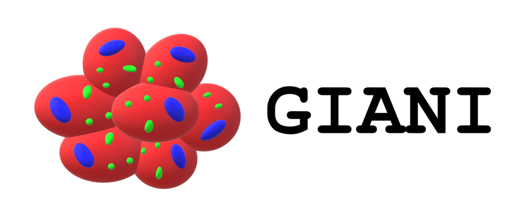

  

# Overview

GIANI is a FIJI plugin designed to facilitate routine analysis of 3D cell biology image data. Implemented specifically with batch-processing in mind, GIANI is designed to:

* Read data sets in their native, proprietary format
* Automatically segment nuclei and cells
* Measure nuclear and cell morphology, together with fluorescence intensities within these regions.
* Allow users to explore their results

# Segment Nuclei and Cells

Nuclei locations are estimated using blob detection...

...before full segmentation is achieved using a watershed operation...

...and then cells are similarly segmented:

# Obtain Measurements

A complete set of morphological and intensity descriptors, across an unlimited number of channels, can then be obtained from the above segmentations.

# Further Segmentation

If you wish, you can segment smaller, sub-cellular structures using additional blob detection:

# Explore Results

Examine your results using the included results browser:

# Want To Learn More?

See [the Wiki](https://github.com/djpbarry/Giani/wiki) for installation instructions and full documentation.

# Citing GIANI

Please cite the following publication if you use GIANI in your work:

David J. Barry, Claudia Gerri, Donald M. Bell, Rocco D’Antuono, Kathy K. Niakan. GIANI: open-source software for automated analysis of 3D microscopy images. bioRxiv 2020.10.15.340810; doi: https://doi.org/10.1101/2020.10.15.340810 
